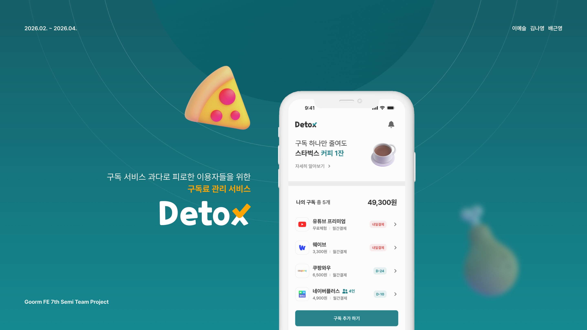
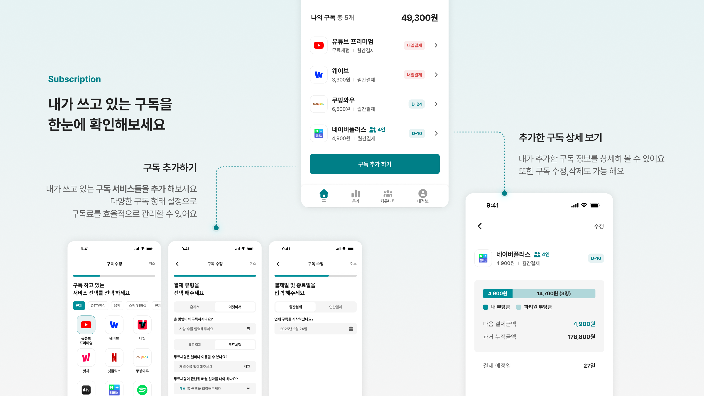
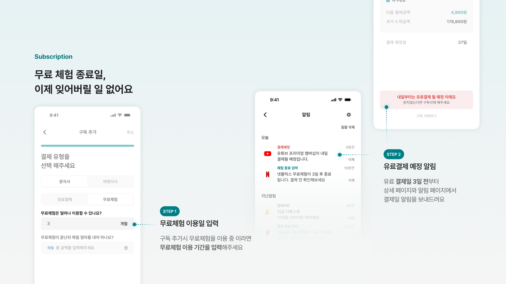
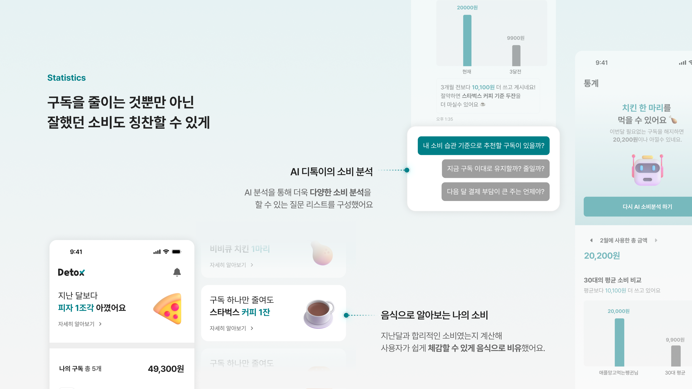
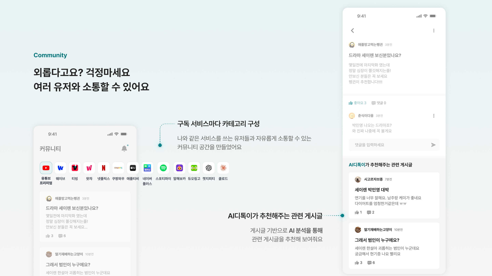

디톡스는 구독을 한곳에서 관리하고, AI로 구독료 소비 분석을 할 수 있는 **디지털 구독 다이어트 웹 서비스** 입니다

## 서비스 소개

#### 구독관리 👀



#### 결제알림 🔔



#### 소비분석 🤖



#### 커뮤니티 💬



## 기술 스택

| 영역            | 사용                                                            |
| --------------- | --------------------------------------------------------------- |
| 프레임워크      | **Next.js 16** (App Router), **React 19**                       |
| 스타일          | **Tailwind CSS 4**, Radix UI, Framer Motion                     |
| 아이콘          | Font Awesome (React)                                            |
| 백엔드·인증     | **Supabase** (DB, Auth, `@supabase/ssr`로 서버/클라이언트 연동) |
| 서버 상태       | **TanStack React Query 5**                                      |
| 클라이언트 상태 | **Zustand** (예: AI 분석 결과 로컬 persist)                     |
| 차트            | Recharts                                                        |
| AI (선택 기능)  | OpenAI 스트리밍, Tavily 검색 (`/api/analyze`)                   |

## 시작하기

### 요구 사항

- **Node.js 20** 권장
- **npm**

### 설치 및 개발 서버

```bash
npm install
npm run dev
```

[http://localhost:3000](http://localhost:3000) 에서 확인하세요.

### npm 스크립트

| 명령                              | 설명                                             |
| --------------------------------- | ------------------------------------------------ |
| `npm run dev`                     | 개발 서버                                        |
| `npm run build`                   | 프로덕션 빌드                                    |
| `npm run lint`                    | ESLint                                           |
| `npm run generate-supabase-types` | Supabase 스키마 → `types/supabase.types.ts` 생성 |

## 환경 변수

루트에 `.env.local` 을 두고 설정하세요.

### 필수 (앱·DB·인증)

| 변수                            | 설명                  |
| ------------------------------- | --------------------- |
| `NEXT_PUBLIC_SUPABASE_URL`      | Supabase 프로젝트 URL |
| `NEXT_PUBLIC_SUPABASE_ANON_KEY` | Supabase anon 공개 키 |

### AI 분석 기능 사용 시

통계의 AI 디톡이·`/api/analyze` 를 쓰려면 아래 환경 변수를 추가로 설정하세요.

| 변수             | 설명               |
| ---------------- | ------------------ |
| `OPENAI_API_KEY` | OpenAI API 키      |
| `TAVILY_API_KEY` | Tavily 검색 API 키 |

타입 생성 스크립트 실행 시 `NEXT_PUBLIC_SUPABASE_PROJECT_ID` 가 필요할 수 있어요.

## 주요 디렉토리

```
app/         # App Router 페이지, 레이아웃, 라우트 핸들러
  (home)/    # 홈
  community/ # 커뮤니티 목록, 상세, 작성, 수정
  subscription/ # 구독 CRUD
  statistics/   # 통계
  statistics/ai/ # AI 분석 화면
  mypage/, login/, notifications/
  api/       # Route Handlers
  components/ # 공통 UI
  providers/ # React Query 등 프로바이더
query/       # React Query 키, 옵션, mutation
services/    # Supabase 호출 등 서버 통신 레이어
store/       # Zustand 스토어
components/  # 공통 UI 컴포넌트
types/       # Supabase 타입 등 공통 타입
```

- 초기 데이터 준비가 필요한 화면은 서버 컴포넌트에서 처리하고, 폼/훅/인터랙션이 필요한 화면은 `"use client"` 로 분리하세요.

## 협업 가이드

### 브랜치와 커밋

- 작업은 가능한 한 **이슈 기준**으로 진행했고, PR에는 관련 이슈를 `Closes #번호` 형태로 연결했어요.
- 새 작업 전에는 `main` 기준으로 브랜치를 분기했어요.
- 브랜치 이름은 작업 성격이 드러나게 작성했어요.
  예: `feat/#104`, `fix/#103`, `refactor/#111`

- 현재 저장소는 작업 유형을 앞에 붙이는 형식을 주로 사용했어요.
- 예:
  - `[Feature] 커뮤니티 AI 추천 게시글 (#110)`
  - `[Fix] 담당 오류 수정 (#103)`
  - `[Refactor] 로그인/커뮤니티 검증 및 성능 개선 (#111)`

작업 성격이 보이도록 `Feature`, `Fix`, `Refactor` 등을 앞에 붙이고, 가능하면 관련 이슈 번호를 함께 적었어요.

### PR 작성

- `.github/pull_request_template.md` 템플릿을 사용했어요.
- PR 본문에는 아래 내용을 우선 정리했어요.
  - 작업 배경과 개요
  - 관련 이슈
  - 주요 변경 사항
  - UI 변경 시 스크린샷
  - 로컬 검증 여부

### 코드 작성 원칙

- 페이지에서 직접 데이터베이스 호출 로직을 늘리기보다는, `services/` 와 `query/` 를 통해 역할을 나누는 것을 기본 원칙으로 뒀어요.
- 전역 UI는 `app/components/` 또는 `components/ui/` 에서 공통으로 관리했어요.
- 도메인 계산 로직, 포맷팅, 라우팅 유틸은 `app/utils/` 에서 분리했어요.

### 검증

- 기본적으로 아래 명령을 확인했어요.

```bash
npm run lint
npm run build
```

- 기능 변경이 있으면 관련 플로우를 직접 확인하는 방식으로 수동 검증했어요.
- UI/성능 개선이 포함된 작업은 스크린샷이나 측정 근거를 PR에 함께 남겼어요.
- Supabase 스키마가 바뀌면 타입을 다시 생성했어요.

```bash
npm run generate-supabase-types
```

### 협업 시 주의할 점

- `.env.local` 과 같은 개인 환경 변수 파일은 커밋하지 마세요.
- 전역 스타일, 공통 헤더/네비게이션, 인증 흐름처럼 영향 범위가 큰 변경은 별도 이슈 또는 PR로 분리하는 것을 권장해요.
- 리뷰에서 지적된 내용은 단순 수정뿐 아니라, 변경 범위가 현재 PR에 적절한지도 함께 판단했어요.

## 팀 멤버

<table>
  <tr>
    <td align="center" width="220">
      <br />
      <strong>이예슬</strong><br />
      <a href="https://github.com/Leemainsw">@Leemainsw</a>
    </td>
    <td align="center" width="220">
      <br />
      <strong>김나영</strong><br />
      <a href="https://github.com/KNY1005">@KNY1005</a>
    </td>
    <td align="center" width="220">
      <br />
      <strong>배근영</strong><br />
      <a href="https://github.com/lyla-bae">@lyla-bae</a>
    </td>
  </tr>
</table>
